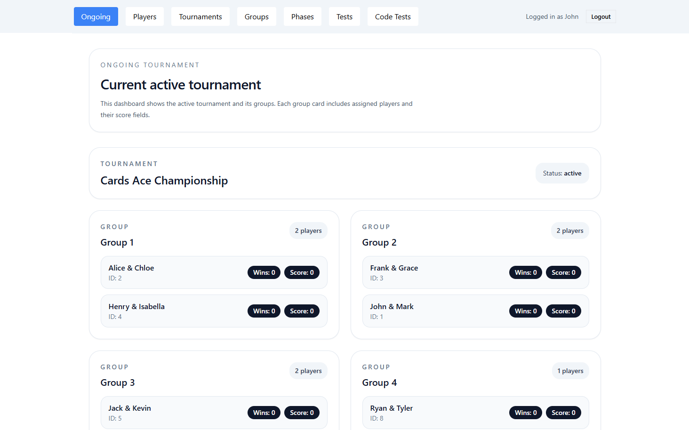
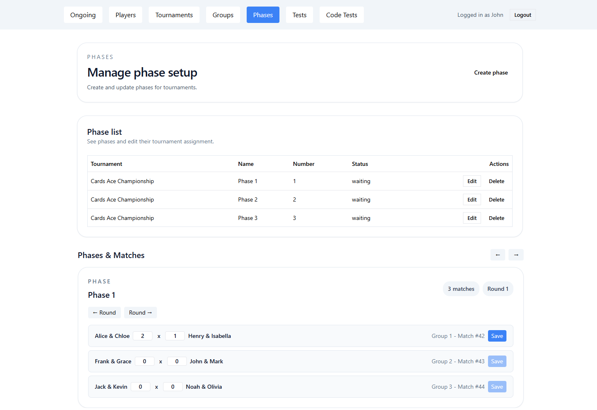
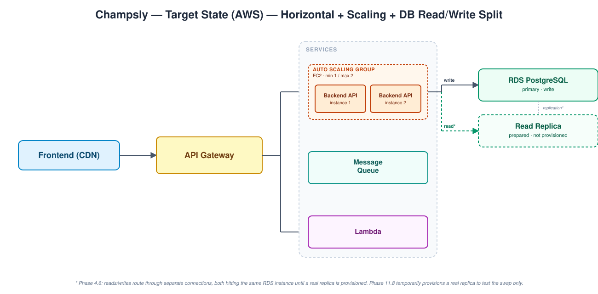
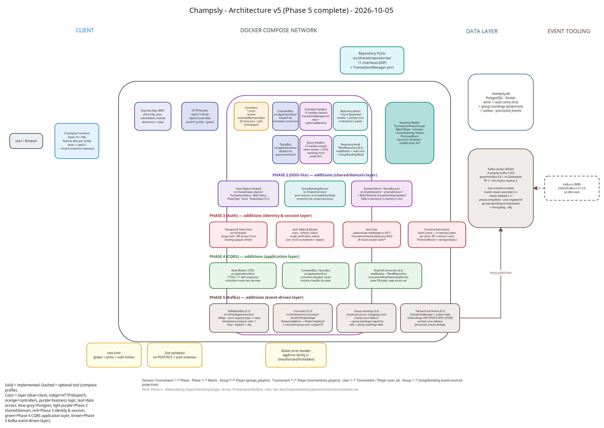
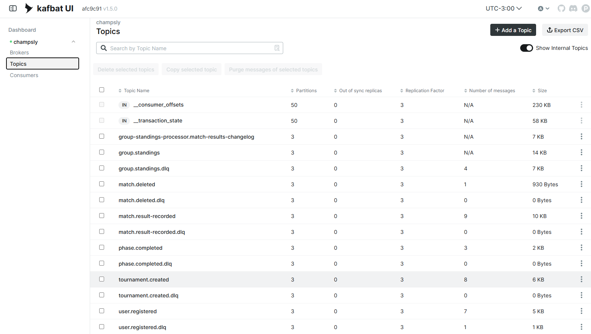

# Champsly

A tournament management platform: create tournaments, seed groups, auto-generate a round-robin match schedule, and track results and standings through to completion. The domain model isn't tied to any single game — `Tournament` → `Phase` → `Group`/`Match` → `Player` is generic enough to run a tournament for cards, sports, esports, or anything else played in brackets or groups.

This is also a learning project: the [architecture evolution plan](docs/implementation-plans/architecture-evolution.md) is a deliberate, staged roadmap from a working MVP toward a production-grade, cloud-deployed system (DDD-lite, CQRS, event-driven architecture with Kafka, observability, AWS via LocalStack and then real AWS, Kubernetes) — each phase chosen to demonstrate a specific principle, not just to add features.

## Preview

The app isn't deployed anywhere yet, so here's what it looks like running locally.


*Dashboard view of an ongoing tournament — groups, assigned players, wins, and scores.*


*Phase management — creating phases and entering match scores round by round.*

## Monorepo layout

```
backend/     Node.js/Express + TypeScript REST API (see backend/CLAUDE.md)
frontend/    React + TypeScript + Vite web app (see frontend/CLAUDE.md)
lambdas/     Standalone AWS Lambda functions (Phase 7.6 / 9.7 — not yet implemented)
terraform/   Infrastructure as code for LocalStack and real AWS (Phase 7.7 / 9.2 — not yet implemented)
docs/        Architecture plan and other project documentation
```

Everything lives in one repository deliberately — see the "Monorepo structure decision" in the [architecture plan](docs/implementation-plans/architecture-evolution.md#2-target-architecture-end-state) for the reasoning.

## Tech stack

**Backend** — Node.js, Express, TypeScript, Sequelize (PostgreSQL), Awilix (dependency injection), Zod (validation), Pino (structured logging).

**Frontend** — React 19, TypeScript, Vite, Tailwind CSS, shadcn/ui, axios.

**Local infrastructure** — Docker Compose, PostgreSQL, Kafka (3-node KRaft cluster, `kafkajs` client) + kafka-ui.

## System Design



The target-state AWS deployment (Phase 10/11 of the [architecture evolution plan](docs/implementation-plans/architecture-evolution.md)): the frontend (S3 + CloudFront) leads into API Gateway, which routes to an Auto Scaling Group of Backend API instances (Phase 11.3), a Lambda for the stateless schedule-preview route (10.7), and a Message Queue, before reaching RDS PostgreSQL. The database panel shows the CQRS read/write connection split built in Phase 4.6 — both connections point at the same instance until Phase 11.8 temporarily provisions a real read replica to test the swap.

## Getting started

The project runs via Docker Compose — this is the primary and supported way to run it locally.

**Prerequisites:** Docker and Docker Compose.

```bash
git clone <this-repo>
cd champsly

cp backend/.env.example backend/.env
# edit backend/.env if needed — the defaults match docker-compose.yml

docker compose up -d
docker compose exec champsly-backend npm run migrate
```

| Service | URL | Notes |
|---|---|---|
| Frontend | http://localhost:5173 | React app |
| Backend API | http://localhost:4001/api/v1 | REST API |
| PostgreSQL | localhost:5432 | db `champsly`, user `user` |
| Kafka | localhost:19092 / 29092 / 39092 | 3-node KRaft cluster |
| kafka-ui | http://localhost:8080 | optional: `docker compose --profile tools up -d kafka-ui` |

Source changes on the host are picked up live in both containers — no rebuild needed for day-to-day development. See `backend/CLAUDE.md` for details on the Docker dev workflow (in particular, why `npm install` for a new backend dependency has to run *inside* the container, not on the host).

## API

Routes are versioned under `/api/v1` (with one `/api/v2` route as a worked example of evolving a response shape without breaking existing clients — see plan step 1.8). A Postman collection is available at [`backend/docs/collection_postman.json`](backend/docs/collection_postman.json).

## Architecture

```
Request → Controller → Interactor (business logic) → Repository → Sequelize Model → PostgreSQL
```

A three-layer clean architecture wired together with constructor injection (Awilix): controllers are thin HTTP handlers, interactors hold all business logic, and repositories are the only layer that talks to Sequelize — accessed by interactors through TypeScript interfaces (`src/shared/repositories/*.types.ts`), not concrete classes, so the data layer can be swapped or faked in tests without touching business logic.

See `backend/CLAUDE.md` for the full layer/naming conventions and `frontend/CLAUDE.md` for the frontend's feature-slice structure.

### Architecture snapshot



A snapshot as of Phase 5 completion: solid boxes are implemented and wired, including the new event-driven layer added in Phase 5. The Kafka placeholder is now a 3-node KRaft cluster (no Zookeeper; RF 3, `min.insync.replicas=2`). Command handlers write their domain events to an `outbox` table inside the same Postgres transaction as the aggregate change, and an `OutboxRelay` publishes them to Kafka, so an event is never lost between the DB write and the publish. Consumers react to those events (verification email, automatic phase completion), and group standings are now an event-sourced projection: a stream processor folds `match.result-recorded`/`match.deleted` into `group.standings` snapshots with exactly-once Kafka transactions, and a sink writes them to the `group_standings` table that queries read from. The dashed `kafka-ui` box is an optional tool started with the `tools` compose profile. See the [architecture evolution plan](docs/implementation-plans/architecture-evolution.md) for where each remaining piece lands as later phases land, or the [Phase 4](docs/architecture-diagrams/v4.png) / [Phase 3](docs/architecture-diagrams/v3.png) / [Phase 2](docs/architecture-diagrams/v2.png) / [Phase 1](docs/architecture-diagrams/v1.png) diagrams for earlier snapshots.

### Kafka topics


*The running cluster as seen in kafka-ui: one topic per domain event (`tournament.created`, `match.result-recorded`, `match.deleted`, `phase.completed`, `user.registered`), each with its own `.dlq`, plus the stream processor's compacted changelog and `group.standings` output. Every topic has 3 partitions and replication factor 3 with no out-of-sync replicas; `__transaction_state` is where Kafka tracks transactions, which lets the standings processor write each result all-or-nothing, so no update is lost or applied twice.*

## Project status

Phases 1 through 5 of the [architecture evolution plan](docs/implementation-plans/architecture-evolution.md) are complete:

- **Phase 1 — Foundation Hardening:** environment config, global error handling, request validation, structured logging, API versioning, rate limiting, Docker Compose, a full TypeScript migration, and repository interfaces enforcing dependency inversion.
- **Phase 2 — Entities & Value Objects (DDD-lite):** type-safe value objects (`TournamentStatus`, `MatchStatus`, `Score`, `PhaseType`), entity behavior moved onto the models (`Tournament.canStart/canFinish`, `Match.recordResult`, `Group.canAddPlayer`), standings computation extracted out of the repository into a pure service, `CreateTournamentInteractor` decoupled from other interactors, and an in-memory domain event bus (`TournamentCreated`, `MatchResultRecorded`, `PhaseCompleted`).
- **Phase 3 — Authentication & Login:** bcrypt password hashing, short-lived JWT access tokens with rotating opaque refresh tokens (reuse of a rotated-away token triggers theft detection, killing the whole session chain), email verification with a resend flow, `authenticate.middleware.ts` and `TournamentOwnershipService` scoping every tournament/group/phase/match to its owner, per-route rate limiting plus Helmet/CSP, and the matching frontend: `AuthContext`, a shared `api-client` with a 401→refresh→retry interceptor, register/login/verify-email screens, and protected routes.
- **Phase 4 — CQRS:** write interactors renamed to command handlers (16) and read interactors to query handlers (12), each dispatched through a `CommandBus`/`QueryBus` instead of controllers resolving them by name, query handlers returning DTOs (`src/application/dtos/`) instead of raw Sequelize rows, and a second `readModels` Sequelize connection with its own `*ReadRepository` set and read-bound `TournamentOwnershipService` — pointed at the same database today, repointable to a real read replica later via env vars alone.
- **Phase 5 — Event-Driven Architecture with Kafka:** a 3-node KRaft Kafka cluster (plus `kafka-ui`), a `KafkaEventBus` on `kafkajs` with an event registry, `schemaVersion`ed events, retries and per-topic dead-letter queues, consumers for verification email and automatic phase completion, group standings rebuilt as an event-sourced projection by a stream processor with a changelog-backed state store and exactly-once Kafka transactions, and a transactional outbox (`TransactionManager`, `outbox` table, `OutboxRelay`, `processed_events` deduplication) so publishing is atomic with the Postgres write.

Phase 6 (observability) onward — testing, AWS deployment, Kubernetes — is planned but not yet started; see the plan for the full roadmap and the reasoning behind each step.

## License

[MIT](LICENSE)
