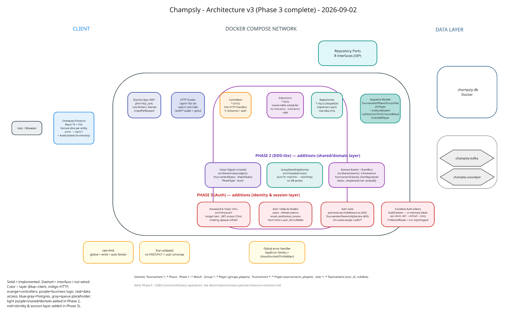

# Champsly

A tournament management platform: create tournaments, seed groups, auto-generate a round-robin match schedule, and track results and standings through to completion. The domain model isn't tied to any single game — `Tournament` → `Phase` → `Group`/`Match` → `Player` is generic enough to run a tournament for cards, sports, esports, or anything else played in brackets or groups.

This is also a learning project: the [architecture evolution plan](docs/implementation-plans/architecture-evolution.md) is a deliberate, staged roadmap from a working MVP toward a production-grade, cloud-deployed system (DDD-lite, CQRS, event-driven architecture with Kafka, observability, AWS via LocalStack and then real AWS, Kubernetes) — each phase chosen to demonstrate a specific principle, not just to add features.

## Monorepo layout

```
backend/     Node.js/Express + TypeScript REST API (see backend/CLAUDE.md)
frontend/    React + TypeScript + Vite web app (see frontend/CLAUDE.md)
lambdas/     Standalone AWS Lambda functions (Phase 7.6 / 9.7 — not yet implemented)
terraform/   Infrastructure as code for LocalStack and real AWS (Phase 7.7 / 9.2 — not yet implemented)
docs/        Architecture plan and other project documentation
```

Everything lives in one repository deliberately — see the "Monorepo structure decision" in the [architecture plan](docs/implementation-plans/architecture-evolution.md#2-target-architecture-end-state) for the reasoning.

## Tech stack

**Backend** — Node.js, Express, TypeScript, Sequelize (PostgreSQL), Awilix (dependency injection), Zod (validation), Pino (structured logging).

**Frontend** — React 19, TypeScript, Vite, Tailwind CSS, shadcn/ui, axios.

**Local infrastructure** — Docker Compose, PostgreSQL, Kafka + Zookeeper (provisioned as a placeholder for Phase 4, not yet consumed by the app).

## Getting started

The project runs via Docker Compose — this is the primary and supported way to run it locally.

**Prerequisites:** Docker and Docker Compose.

```bash
git clone <this-repo>
cd champsly

cp backend/.env.example backend/.env
# edit backend/.env if needed — the defaults match docker-compose.yml

docker compose up -d
docker compose exec champsly-backend npm run migrate
```

| Service | URL | Notes |
|---|---|---|
| Frontend | http://localhost:5173 | React app |
| Backend API | http://localhost:4001/api/v1 | REST API |
| PostgreSQL | localhost:5432 | db `champsly`, user `user` |
| Kafka | localhost:9092 | provisioned, unused until Phase 4 |

Source changes on the host are picked up live in both containers — no rebuild needed for day-to-day development. See `backend/CLAUDE.md` for details on the Docker dev workflow (in particular, why `npm install` for a new backend dependency has to run *inside* the container, not on the host).

## API

Routes are versioned under `/api/v1` (with one `/api/v2` route as a worked example of evolving a response shape without breaking existing clients — see plan step 1.8). A Postman collection is available at [`backend/docs/collection_postman.json`](backend/docs/collection_postman.json).

## Architecture

```
Request → Controller → Interactor (business logic) → Repository → Sequelize Model → PostgreSQL
```

A three-layer clean architecture wired together with constructor injection (Awilix): controllers are thin HTTP handlers, interactors hold all business logic, and repositories are the only layer that talks to Sequelize — accessed by interactors through TypeScript interfaces (`src/shared/repositories/*.types.ts`), not concrete classes, so the data layer can be swapped or faked in tests without touching business logic.

See `backend/CLAUDE.md` for the full layer/naming conventions and `frontend/CLAUDE.md` for the frontend's feature-slice structure.

### System design



A snapshot as of Phase 3 completion: solid boxes are implemented and wired, including the new identity & session layer added in Phase 3 — password hashing and JWT/refresh-token infrastructure, the `users`/`refresh_tokens`/`email_verification_tokens` tables, the `authenticate.middleware.ts` + `TournamentOwnershipService` auth gate, and the frontend's `AuthContext` and `api-client` refresh-and-retry interceptor. Kafka/Zookeeper still aren't consumed — that lands in Phase 5. See the [architecture evolution plan](docs/implementation-plans/architecture-evolution.md) for where each remaining piece lands as later phases land, or the [Phase 2](system_design/v2.png) / [Phase 1](system_design/v1.png) diagrams for earlier snapshots.

## Project status

Phases 1 through 3 of the [architecture evolution plan](docs/implementation-plans/architecture-evolution.md) are complete:

- **Phase 1 — Foundation Hardening:** environment config, global error handling, request validation, structured logging, API versioning, rate limiting, Docker Compose, a full TypeScript migration, and repository interfaces enforcing dependency inversion.
- **Phase 2 — Entities & Value Objects (DDD-lite):** type-safe value objects (`TournamentStatus`, `MatchStatus`, `Score`, `PhaseType`), entity behavior moved onto the models (`Tournament.canStart/canFinish`, `Match.recordResult`, `Group.canAddPlayer`), standings computation extracted out of the repository into a pure service, `CreateTournamentInteractor` decoupled from other interactors, and an in-memory domain event bus (`TournamentCreated`, `MatchResultRecorded`, `PhaseCompleted`).
- **Phase 3 — Authentication & Login:** bcrypt password hashing, short-lived JWT access tokens with rotating opaque refresh tokens (reuse of a rotated-away token triggers theft detection, killing the whole session chain), email verification with a resend flow, `authenticate.middleware.ts` and `TournamentOwnershipService` scoping every tournament/group/phase/match to its owner, per-route rate limiting plus Helmet/CSP, and the matching frontend: `AuthContext`, a shared `api-client` with a 401→refresh→retry interceptor, register/login/verify-email screens, and protected routes.

Phase 4 (CQRS) onward — Kafka event-driven architecture, observability, testing, AWS deployment, Kubernetes — is planned but not yet started; see the plan for the full roadmap and the reasoning behind each step.

## License

[MIT](LICENSE)
